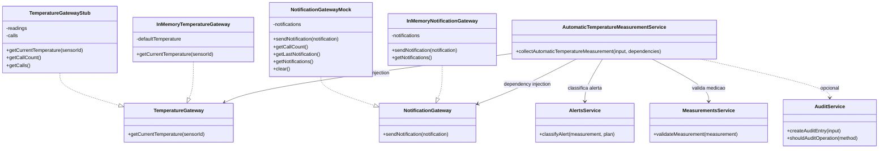

# Diagrama de classes global - Sprint 6

Este diagrama representa os componentes produtivos relacionados com a medicao automatica de temperatura e os duplos de teste usados no Sprint 6.

## Papel das classes

| Classe / Componente | Papel |
| --- | --- |
| `AutomaticTemperatureMeasurementService` | Orquestra a leitura automatica, cria a medicao, classifica o alerta e envia notificacao quando aplicavel. |
| `TemperatureGateway` | Abstracao da fonte externa de temperatura. |
| `InMemoryTemperatureGateway` | Implementacao local simples que devolve uma temperatura padrao. |
| `TemperatureGatewayStub` | Duplo de teste que devolve leituras previsiveis e sequenciais. |
| `NotificationGateway` | Abstracao do envio de notificacoes. |
| `InMemoryNotificationGateway` | Implementacao local simples que apenas guarda notificacoes em memoria. |
| `NotificationGatewayMock` | Duplo de teste que regista chamadas para permitir verificacao de interacoes. |
| `AlertsService` | Classifica medicoes fora dos limites do plano. |
| `MeasurementsService` | Valida a estrutura e coerencia da medicao. |
| `AuditService` | Componente de auditoria existente, mantido como dependencia opcional. |

## Justificacao dos duplos

O `TemperatureGatewayStub` foi escolhido porque a medicao automatica depende de uma fonte externa. Nos testes, o objetivo e controlar as leituras devolvidas: dentro dos limites, fora dos limites, sensor invalido e ausencia de leitura.

O `NotificationGatewayMock` foi escolhido porque nao queremos enviar notificacoes reais. Nos testes, o objetivo e verificar se a aplicacao tentou enviar a notificacao correta, com destinatario, tipo, mensagem, payload e numero de chamadas.
